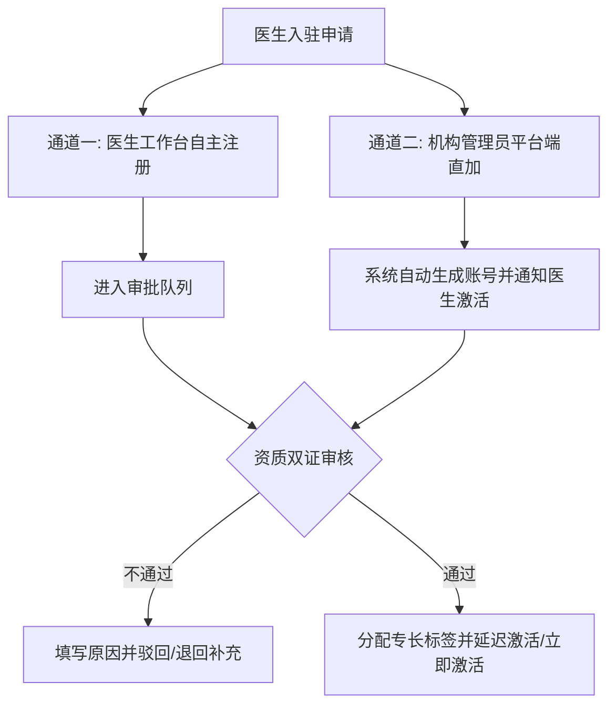
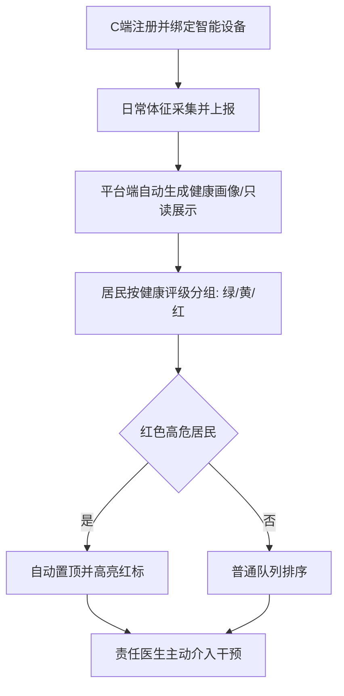
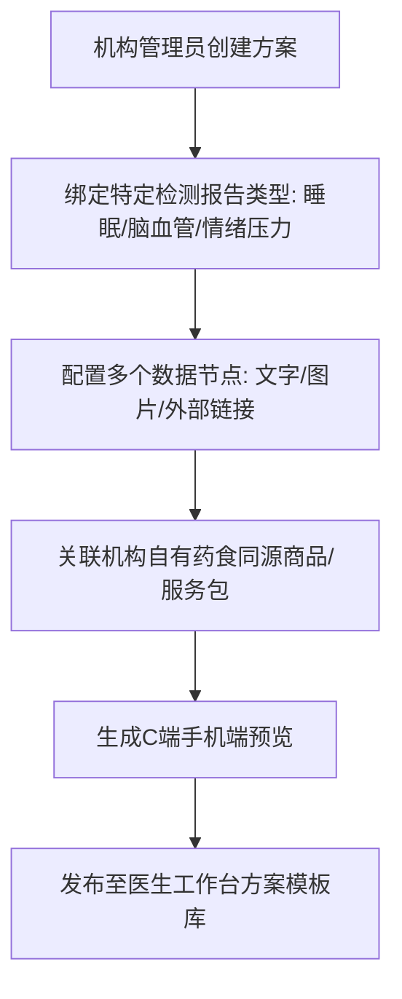
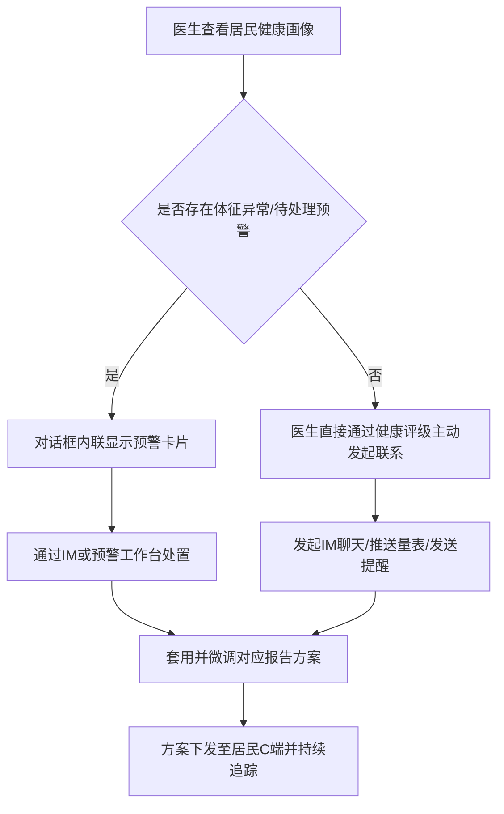

# 主动健康管理机构端 PRD (产品需求文档)

---

## 1. Summary (项目摘要)
本项目是面向健康管理机构的多角色运营管理平台。系统以「居民健康画像」为核心数据资产，以「医生主动干预」为核心服务模式，通过连接C端居民、平台端医生/客服以及机构管理员，实现从居民自主注册与体征采集、健康画像自动生成、医生主动干预到机构服务质量监管的闭环管理。

---

## 2. Contacts (联系人)
以下为项目的主要相关干系人（示例）：
- **项目发起人/业务负责人**: [姓名/部门] — 负责业务方向把控与资源协调
- **产品经理 PM**: [姓名] — 负责需求整理、产品设计与文档维护
- **前端工程师**: [姓名] — 负责机构端与医生工作台的前端交互及动效实现
- **后端工程师**: [姓名] — 负责后台系统架构与数据接口设计
- **客服团队主管**: [姓名] — 负责客服人员培训与沟通辅助职责落地
- **首席医学顾问**: [姓名] — 负责调理方案规范与医学预警逻辑审查

---

## 3. Background (项目背景)
在传统的健康管理中，服务通常是“被动预警响应”或“单向预警推送”的模式。这种方式存在医患互动薄弱、居民依从性差、干预效果难以追踪等痛点。
主动健康管理平台旨在打破这一局限：
- **健康画像驱动**: 自动汇聚居民体征数据与检测报告，生成多维度健康画像，使医生能够获得连续的、全景的健康信息。
- **主动发起服务**: 医生可以基于画像主动联系居民，发起就诊提醒、方案推荐或院后随访，由被动应对转为主动出击。
- **报告驱动方案**: 调理方案摆脱商品SKU的强绑定，围绕睡眠、脑血管、情绪压力等具体检测报告类型按节点配置，提供科学专业的调理建议，增强居民信任。
- **服务质量度量**: 通过监管大屏将预警响应率、医生干预频次及满意度等指标化，确保服务质量可监管、医生绩效可量化。

---

## 4. Objective (项目目标与关键结果)
### 4.1 项目目标
建立多角色协同的机构健康管理闭环，提升机构在管居民的健康干预覆盖率与满意度，提高医生的执业效率与服务质量，使机构的运营数据与人效指标清晰可见。

### 4.2 关键结果 (SMART OKR 格式)
- **KR 1 (干预率)**: 上线后红色高危居民的医生干预覆盖率达到 100%。
- **KR 2 (响应时效)**: 待处理预警的平均响应归档耗时降低至 15 分钟以内。
- **KR 3 (方案采用)**: 每位绑定的在管居民至少下发并查看过 1 套与其检测报告相匹配的个性化调理方案。
- **KR 4 (设备管理)**: 低电量（<20%）及离线智能穿戴设备的客服跟进反馈率达到 95% 以上。

---

## 5. Market Segment(s) (目标用户与市场细分)
本平台面向以下核心用户角色进行构建：
1. **机构管理员 (Admin)**: 负责机构管理、医生资质审批、调理方案配置、商品及服务包维护、业务监管以及系统配置。
2. **平台医生 (Doctor)**: 负责个人执业信息和科普主页维护、管理我的病人、查阅居民健康画像、套用下发方案、与居民进行IM沟通、处置预警通知。
3. **平台客服 (Customer Service - 本版新增 P0 角色)**: 负责协助维护居民关系、查看居民档案、辅助医生进行部分随访和沟通任务，但无敏感管理和审批权限。
4. **在管居民 (Resident - 外部C端用户)**: 通过智能手表采集血压、心率、血氧、睡眠等体征，并接受医生的主动关怀与调理方案。

---

## 6. Value Proposition(s) (价值主张)
- **对居民**: 获得“有温度”的主动关怀。不单是收到冷冰冰的警报，而是有责任医生与客服根据其体征和检测报告，提供个性化调理方案与实时IM随访。
- **对医生**: 提供一站式的执业与干预工作台。集成完整健康画像、常用语模板、预警内联卡片和30秒刷新的体征看板，使沟通和干预更加高效、精准。
- **对机构**: 提高人效与转化率。调理方案可关联机构自有的药食同源产品和服务包，利用专业建议自然引导居民购买，并通过大屏实时监控警情态势与医生绩效。

---

## 7. Solution (解决方案)

### 7.1 核心业务流程
下面展示本平台的4个核心业务流程设计：

#### 1) 医生入驻审批流程 (双通道模式)

#### 2) 在管居民生命周期管理

#### 3) 调理方案维护流程 (检测报告驱动)

#### 4) 医生主动干预与沟通流程

---

### 7.2 Key Features (功能清单)

#### 7.2.1 机构管理端功能清单 (9个模块)

##### M01. 医生入驻审批 (优先级: P0 核心)
管理医生入驻申请的全流程审批。支持医生工作台自注册审核与管理员直接创建账号的双通道模式。

| 功能点 | 功能描述 | 核心能力 | 优先级 |
| :--- | :--- | :--- | :--- |
| **待审批列表** | 展示所有来源的医生入驻申请，显示基本资料与提交时间。支持按科室分类与状态筛选，支持批量审批。 | 双通道来源聚合、多条件筛选、批量审批 | P0 核心 |
| **资质审核详情** | 查看完整执业信息及执业证+职称证扫描件。支持在线放大、信息完整性及证件日期有效性自动校验。 | 双证在线预览、必填项检测、有效性校验 | P0 核心 |
| **审批操作** | 支持三种审批动作：「通过」（可延迟激活）、「驳回」（须填写原因并通知医生）、「禁用/停用」（二次确认封禁）。 | 三态审批、延迟激活、驳回通知、操作日志 | P0 核心 |
| **已入驻医生管理** | 全量展示已激活医生列表，包含在管居民数、最近干预时间。支持科室/职称筛选及Excel报表导出。 | 多维展示、筛选搜索、Excel导出 | P1 重要 |
| **管理员直加医生** | 录入基本信息与资质直接创建账号，系统自动生成凭据并发送短信/消息通知医生激活。 | 直接创建账号、自动生成登录凭据、短信通知 | P1 重要 |

---

##### M02. 在管居民档案管理 (优先级: P0 核心)
管理在管居民的健康档案与关系。以「查看与管理」为核心，不做数据录入操作。

| 功能点 | 功能描述 | 核心能力 | 优先级 |
| :--- | :--- | :--- | :--- |
| **居民队列查看** | 展示居民列表，按健康评级（绿-正常/黄-亚健康/红-高危）三色分级显示，红色高危自动置顶。 | 三色分级、高危置顶、多维筛选排序 | P0 核心 |
| **健康画像详情** | 查看实时体征、体征趋势折折线图、关联检测报告及历史预警触发记录。数据只读展示。 | 趋势图表、检测报告关联、预警历史、只读展示 | P0 核心 |
| **居民关系展示** | 以图谱形式展示责任医生、客服、关注医生关系。以时间轴展示联系、干预、预警等服务轨迹。 | 关系图谱可视化、服务轨迹时间轴、关系链评估 | P0 核心 |
| **居民数据导出** | 支持按筛选条件导出居民数据为CSV或PDF文件，供运营分析使用。 | 多格式导出、字段自定义、批量导出 | P2 增强 |

---

##### M03. 调理方案维护 (优先级: P0 核心)
按检测报告类型（睡眠/脑血管/情绪压力等）配置调理方案内容。方案以节点为单位，支持一对多配置，可关联药食同源产品。

| 功能点 | 功能描述 | 核心能力 | 优先级 |
| :--- | :--- | :--- | :--- |
| **方案列表与分类** | 按检测报告类型（Tab切换）展示配置方案。每套方案以卡片形式展示节点数、最后编辑时间等。 | 报告分类展示、卡片浏览、一对多列表 | P0 核心 |
| **新增/编辑方案** | 输入方案名称，选择报告类型。方案内容由多个数据节点组成，可配置文字/图片/外部链接并调序。 | 方案CRUD、报告绑定、多节点编辑、节点排序 | P0 核心 |
| **方案节点编辑面板** | 展开节点编辑区。支持节点拖拽排序、弹窗编辑内容、二次确认删除等操作。 | 拖拽排序、分类型编辑弹窗、节点删除 | P0 核心 |
| **一对多方案管理** | 同一检测报告类型下可创建多套方案独立维护（例如基础版/进阶版），支持医生选择性下发。 | 同类型多方案、版本管理、医生选版下发 | P0 核心 |
| **方案关联产品** | 可在方案节点附加关联药食同源商品或服务包，下发方案时自动带出推荐卡片以引导购买。 | 商品关联、推荐卡片自动生成、引导转化 | P1 重要 |
| **方案预览与发布** | 提供模拟手机屏幕的C端展示效果预览。支持草稿保存与暂不上线，发布后模板库可见。 | 手机模拟预览、状态切换、模板库联动 | P1 重要 |

---

##### M04. 调理服务包维护 (优先级: P1 重要)
配置标准化的健康调理服务套餐，包含服务名称、描述、定价、周期等，可关联商品并在C端销售。

| 功能点 | 功能描述 | 核心能力 | 优先级 |
| :--- | :--- | :--- | :--- |
| **服务包列表** | 展示调理服务包列表，显示服务周期、定价、关联商品数及发布状态（已发布/草稿/下架）。 | 状态筛选、关键字搜索、排序 | P1 重要 |
| **配置调理包** | 新增/编辑服务名称、图文描述、定价、周期及关联推荐商品。支持保存草稿或直接发布。 | 参数化配置、关联商品、草稿发布 | P1 重要 |
| **上/下架管理** | 一键生效/停用。下架后C端不可见，但不影响已购居民的历史服务和数据。 | 状态切换、已购服务保护、历史保留 | P1 重要 |
| **服务包销售分析** | 汇总统计服务包的销售数量、营业额、转化率等周/月指标（非实时数据）。 | 销售排行、区间统计、趋势查看 | P2 增强 |

---

##### M05. 药食同源商品维护 (优先级: P1 重要)
管理机构可提供的健康商品（茶饮、膏方、硬件等）的信息与基础库存，不做超卖联动等复杂逻辑。

| 功能点 | 功能描述 | 核心能力 | 优先级 |
| :--- | :--- | :--- | :--- |
| **商品列表** | 展示商品名称、品类、单价及库存。支持按品类筛选，提供低库存高亮提醒。 | 品类筛选、库存低值预警、搜索 | P1 重要 |
| **商品信息管理** | 新增/编辑商品，支持名称、品类字典、单价、描述及图片的维护，修改后即时生效。 | 品类字典、图文信息维护、即时生效 | P1 重要 |
| **库存数量录入** | 支持手动修改库存量，记录包含操作人、时间、变更量的日志，作为内部参考。 | 库存手动变更、操作日志、内部分析 | P1 重要 |
| **商品上下架** | 提供独立的手动生效/停用开关，下架商品在C端隐蔽，不影响历史数据。 | 手动控制、历史数据保护 | P2 增强 |

---

##### M06. CMS 内容运营管理 (优先级: P1 重要)
管理居民端 App/小程序首页的 Banner 广告投放与推荐名医列表排序。

| 功能点 | 功能描述 | 核心能力 | 优先级 |
| :--- | :--- | :--- | :--- |
| **Banner广告投放** | 管理首页轮播广告图，支持图片上传、跳转链接配置、投放时间段设置及投放开关控制。 | 图片上传、链接配置、时段控制、排序调节 | P1 重要 |
| **推荐名医权重** | 选中入驻医生，配置推荐宣传语及排序权重分（1-100），C端按权重降序排列以优化曝光。 | 权重分排序、宣传语配置、曝光调节 | P1 重要 |
| **科普内容审核** | 对医生发布的文章/短视频进行审核。当前版本医生发布内容默认直接上线。 | 审核流、驳回反馈、状态管理 | P3 后续 |

---

##### M07. 业务监管大屏 (优先级: P0 核心)
机构管理者数据一览大屏。整合了原“预警监控”及“医患沟通审计”中的核心绩效，提供全局视图。

| 功能点 | 功能描述 | 核心能力 | 优先级 |
| :--- | :--- | :--- | :--- |
| **运营核心指标面板**| 展示在管居民总数、活跃设备数、新增趋势折线图、成交额Top等，支持点击数字进行明细下钻。| 实时刷新、环比统计、近7日趋势、下钻查询 | P0 核心 |
| **实时预警态势** | 呈现风险类型分布、占比饼图、高危人员地图/列表及预警响应率。整合预警监管大屏。 | 分类预警统计、响应率计算、图表展示 | P0 核心 |
| **医生绩效看板** | 展示医生当月干预次数、方案下发数、预警平均响应耗时及满意度评分的排行榜。 | 绩效排行榜、月度汇总、质量量化 | P1 重要 |
| **设备在线概览** | 展示智能设备在线、离线及低电量（<20%）总数，支持点击下钻到设备明细列表。 | 设备在线率、低电量统计、列表下钻 | P1 重要 |
| **近7日警情趋势** | 分色折线图展示近7天各风险类型（脑血管/睡眠/情绪）的预警趋势，辅助高峰判断。 | 多系列折线图、警情趋势图 | P1 重要 |

---

##### M08. 智能设备管理 (优先级: P1 重要)
管理发放的全部智能穿戴设备（如智能手表），监控设备在线状态及低电量预警。

| 功能点 | 功能描述 | 核心能力 | 优先级 |
| :--- | :--- | :--- | :--- |
| **设备列表与查询** | 显示设备 IMEI、型号、绑定居民、在线状态、当前电量和最后心跳时间。支持多维筛选和搜索。 | IMEI管理、绑定关系查询、状态筛选、搜索 | P0 核心 |
| **在线/离线状态** | 心跳检测，超时未回传信号自动标为「离线」，并将离线状态同步更新至业务监管大屏。 | 心跳检测、自动离线上报、大屏联动 | P1 重要 |
| **低电量标记提醒** | 电量低于 20% 时高亮标记为红色，大屏同步计数，便于客服提醒居民充电或更换设备。 | 阈值触发、低电量高亮、大屏同步 | P1 重要 |
| **OTA固件升级** | 支持远程OTA固件推送，可批量配置策略及追踪进度。 | OTA推送、批量配置、进度追踪 | P3 后续 |

---

##### M09. 系统配置与运营设置 (优先级: P2 增强)
机构级参数配置中心，提供基础信息维护、子账号管理、操作日志审计等。支持多机构 SaaS 隔离。

| 功能点 | 功能描述 | 核心能力 | 优先级 |
| :--- | :--- | :--- | :--- |
| **机构信息维护** | 编辑机构资料、上传 Logo，同步显示于C端机构页面及医生电子执业名片。 | 资料编辑、Logo上传、C端同步 | P1 重要 |
| **子账号管理** | 管理运营人员及客服账号的创建、密码重置、状态开关及角色分配（仅超管可变更角色）。 | 账号CRUD、角色分配、操作控制 | P1 重要 |
| **操作日志审计** | 记录关键操作（审批、配置变更、数据导出）的姓名、时间、IP及变更内容，防篡改。 | 全量操作日志、按条件检索、防篡改 | P2 增强 |
| **费率与分佣配置** | SaaS平台超管端功能：设置各机构的订阅费标准、商品分佣及服务抽成比例。 | 费率模板、分佣配置、历史追溯 | P3 后续 |

---

#### 7.2.2 医生工作台功能清单 (7个模块)

##### D01. 医生信息维护 (优先级: P0 核心)
医生个人执业信息的管理。维护的信息构成C端电子执业名片，用于建立品牌形象并影响居民绑定决策。

| 功能点 | 功能描述 | 核心能力 | 优先级 |
| :--- | :--- | :--- | :--- |
| **执业信息展示** | 只读展示姓名、所属科室、执业年限、职称（不可自行修改，若有变更提示联系管理员）。 | 信息展示、只读保护、变更引导 | P0 核心 |
| **专长标签管理** | 多选并修改擅长调理标签，即时同步至C端名医列表和医生名片。 | 专长多选标签、即时生效、C端同步 | P0 核心 |
| **个人简介编辑** | 500字内个人特色及学术背景编辑，支持实时字数计数与超限自动截断，修改后即时生效。 | 富文本编辑、500字限制、实时字数计数 | P0 核心 |
| **联系方式隐私** | 维护联系电话、微信，可设置隐私范围（对居民公开/仅管理员可见/仅自己可见）。 | 隐私控制（三级）、信息维护 | P1 重要 |

---

##### D02. 医生主页维护 (优先级: P1 重要)
医生在居民端展示的公开主页内容配置，支持知识输出与形象展示。

| 功能点 | 功能描述 | 核心能力 | 优先级 |
| :--- | :--- | :--- | :--- |
| **科普文章发布** | 支持富文本和图文混排的科普文章发布，支持保存草稿与立即发布，可在居民端分享。 | 图文混排编辑、草稿/发布控制 | P1 重要 |
| **短视频发布** | 支持上传MP4视频，支持格式校验及自动截取视频第一帧作为封面，发布后在视频区展示。 | 视频上传、格式校验、封面截取 | P2 增强 |
| **内容列表管理** | 汇总展示个人所有文章与视频的标题、状态、阅读量，支持编辑、下架、删除等操作。 | 状态筛选、分类列表、编辑下架删除 | P1 重要 |
| **主页预览** | 提供居民端App/小程序视图的模拟预览，实时确认排版、图片及视频显示效果。 | 实时预览、多端模拟预览 | P2 增强 |

---

##### D03. 我的病人管理 (优先级: P0 核心)
查看并管理自己责任范围内的在管居民，是医生“主动干预模式”的业务起点。

| 功能点 | 功能描述 | 核心能力 | 优先级 |
| :--- | :--- | :--- | :--- |
| **在管居民列表** | 展示所负责的居民列表。红色高危高亮标记并置顶。显示评级、最近体征数据和最近联系时间。 | 高危置顶标记、健康三色筛选、体征摘要 | P0 核心 |
| **居民健康画像** | 点开居民详情查看实时体征、趋势折线图、关联检测报告、预警历史与干预方案下发记录。 | 画像全景（体征+报告+预警+方案历史） | P0 核心 |
| **主动联系入口** | 在列表行与画像页设快捷键直接发起IM，支持发送就诊提醒、健康量表、随访及方案。 | 快捷发起IM、多样化主动沟通形式 | P0 核心 |
| **居民绑定管理** | 查阅申请绑定自己的居民列表，查看已绑定居民的服务时长、历史记录并确认新绑定关系。 | 绑定管理、服务时长统计、干预历史 | P1 重要 |

---

##### D04. 专科方案管理 (优先级: P1 重要)
制定并下发调理方案。医生套用机构预设模板，根据居民情况微调后一键下发至居民C端并进行效果追踪。

| 功能点 | 功能描述 | 核心能力 | 优先级 |
| :--- | :--- | :--- | :--- |
| **方案模板浏览** | 按检测报告分类浏览机构管理员配置的模板，可预览各节点的文字、图片和链接摘要。 | 模板分类浏览、节点预览、方案全貌预览 | P1 重要 |
| **方案套用与微调**| 套用模板并复制到工作区，微调节点内容（文字/图片/链接），不影响原始公共模板。 | 一键套用、节点微调、保存为个人方案 | P1 重要 |
| **方案下发与追踪**| 一键下发方案至居民C端，实时追踪居民的查看状态（未查看/已查看）及相关的反馈、打卡。 | 一键下发、状态实时追踪、打卡反馈 | P1 重要 |
| **历史方案查询** | 查询已发送的历史方案列表，支持按居民、时间过滤检索，构建医生个人干预经验库。 | 历史方案列表、多维过滤、归档检索 | P2 增强 |

---

##### D05. 个性化对话模板 (优先级: P1 重要)
医患IM即时通讯，挂载30秒刷新的智能手表实时数据看板，并将触发的预警以内联卡片形式在会话中直接呈现。

| 功能点 | 功能描述 | 核心能力 | 优先级 |
| :--- | :--- | :--- | :--- |
| **IM即时通讯** | 一对一对话，支持图文发送。会话窗口挂载手表体征看板，30秒自动刷新并标记异常数据。 | 即时通讯、实时体征看板、异常红色高亮 | P0 核心 |
| **常用语模板管理**| 医生可自建个人快捷回复模板，支持按问候/量表/随访分类管理，IM中一键填充和发送。 | 常用语CRUD、分类模板、一键填充 | P0 核心 |
| **系统预置常用语**| 平台提供就医指导、用药提醒等标准常用语库，支持继承修改并保存为个人模板。 | 标准常用语、继承修改、平台定期维护 | P1 重要 |
| **预警内联卡片** | 异常体征触发时，在IM对话框内嵌不打断聊天流的预警卡片，支持直达画像、下发方案或标记已处理。| 内联卡片展示、会话内快捷处置、无中断体验| P1 重要 |

---

##### D06. 预警处理工作台 (优先级: P0 核心)
处理系统自动异常预警的工作台。作为辅助机制生成预警单，医生快速研判并采取合适动作进行闭环归档。

| 功能点 | 功能描述 | 核心能力 | 优先级 |
| :--- | :--- | :--- | :--- |
| **待处理预警列表**| 按触发时间倒序排列的待处理预警记录。高危行有红色高亮并有闪烁效果，防漏处理。 | 触发倒序展示、高危闪烁提示、关联详情 | P0 核心 |
| **预警处置操作** | 点击进入详情页查阅异常数据与AI分析。必须填写说明后完成“查看画像/下发方案/IM沟通”并归档。| 异常体征详情、AI风险建议、三态快捷归档 | P0 核心 |
| **预警处理统计** | 个人绩效看板：展示累计处理、本月处理、预警平均处理耗时及超时预警数量仪表盘。 | 绩效仪表盘、响应耗时统计、超时预警 | P1 重要 |
| **预警规则查阅** | 查阅当前配置的阈值、频次等触发规则。该功能只读，规则的修改配置在机构管理员端。 | 规则只读查阅、预警阈值展示 | P2 增强 |

---

##### D07. 居民绑定审批 (优先级: P1 重要)
管理C端居民发起绑定医生关系的审批流程，通过后正式建立责任医患服务关联。

| 功能点 | 功能描述 | 核心能力 | 优先级 |
| :--- | :--- | :--- | :--- |
| **绑定申请列表** | 按申请时间排序展示待审批申请。列表卡片展示居民的年龄、设备及检测报告概要。支持批量通过。 | 申请时间排序、多维概要卡片、批量处理 | P1 重要 |
| **绑定审批操作** | 支持「通过」（自动入库并通知居民）或「驳回」（选填驳回原因、通知并引导C端推荐同科室他人）。| 审批通过/驳回、原因通知、关联自动生成 | P1 重要 |
| **在管居民数设置**| 医生可设置最大接诊上限。达上限后，居民端搜索该医生显示「已满额」且隐藏绑定申请入口。 | 上限参数配置、超限自动熔断、动态设置 | P2 增强 |

---

### 7.3 技术与安全性要求 (Technology)
1. **数据源机制**: 平台端数据全部以“只读或辅助记录”为主，不直接生产及修改居民底层体征。体征采集统一由C端配合智能手环/手表自动上传。
2. **实时性保证**: IM沟通窗口中嵌入的手表体征看板，通过长轮询或 WebSocket 协议维持数据每30秒刷新一次，异常体征实时高亮变红。
3. **数据安全与隔离**: 
   - 权限防越界：客服账号只能看到其所属责任域内的居民，且禁用所有审批、商品及大屏监管权限。
   - SaaS隔离：支持多租户（机构）SaaS隔离，不同机构的患者数据、医生信息、分佣费率和操作日志在逻辑上物理隔离。
4. **日志不可篡改**: 机构端操作日志审计模块采用防篡改机制存储，确保每一次敏感操作（数据导出、医生禁用等）都记录 IP 并提供审计追踪。

---

### 7.4 Assumptions (核心假设)
1. **设备佩戴连续性假设**: 假设在管居民日常能够按照建议规律佩戴智能手环/手表并正常联网同步，从而保证平台的健康画像和实时趋势分析不失真。
2. **医生在线习惯假设**: 假设平台入驻医生能定期保持医生工作台登录，保证在管高危居民发生体征预警时能够在15分钟内触发处置归档。
3. **资质真实有效假设**: 假设医生在自注册或机构创建时上传的“执业证+职称证”均真实有效，机构管理员在后台能够通过双证比对确认其合法资格。

---

## 8. Release (发布计划与功能规划)
本系统划分为两阶段进行迭代和上线，以保证核心流程先跑通。

### 第一阶段 (MVP 版本 - 核心闭环)
- **目标**: 实现医生入驻审批、高危居民三色管理、基于特定报告的调理方案下发、IM即时沟通及警情态势响应的核心闭环。
- **包含模块与功能**:
  - 机构管理端:
    - **M01**: 待审批列表、资质审核详情、审批操作（全部 P0 功能）
    - **M02**: 居民队列查看、健康画像详情、居民关系展示（全部 P0 功能）
    - **M03**: 方案分类列表、新增方案、编辑节点面板、一对多方案管理（全部 P0 功能）
    - **M07**: 运营核心指标面板、实时预警态势（P0 功能）
  - 医生工作台:
    - **D01**: 执业信息展示、专长标签管理、个人简介编辑（P0 功能）
    - **D03**: 在管居民列表、居民健康画像查看、主动联系入口（P0 功能）
    - **D05**: IM即时通讯、常用语模板管理（P0 功能）
    - **D06**: 待处理预警列表、预警处置操作（P0 功能）

### 第二阶段 (扩展与增强版本)
- **目标**: 完善机构的商品运营、客服协同机制、内容管理及业务数据深度分析。
- **包含模块与功能**:
  - 机构管理端:
    - **M01/M02**: 医生直加、居民健康报表导出
    - **M03**: 关联产品推荐、模拟C端预览与发布
    - **M04/M05**: 调理服务包维护、药食同源商品维护及基本库存录入
    - **M06**: CMS轮播广告投放、推荐名医权重配置
    - **M07**: 医生绩效排行看板、设备在线状态监控、7日警情趋势分析
    - **M08**: 设备列表与绑定、心跳监控、低电量提醒
    - **M09**: 机构信息配置、子账号（客服角色）管理、操作日志审计
  - 医生工作台:
    - **D01/D02**: 隐私范围控制、科普文章/视频发布与管理、主页预览
    - **D03**: 居民绑定管理
    - **D04**: 方案模板库套用、节点微调与下发追踪、历史方案查询
    - **D05**: 预警内联卡片
    - **D07**: 居民绑定审批、在管上限设置
  - 附录模块:
    - 智能设备远程 OTA 升级规划
    - 居民 30/90 天体检报告与多指标交叉分析
